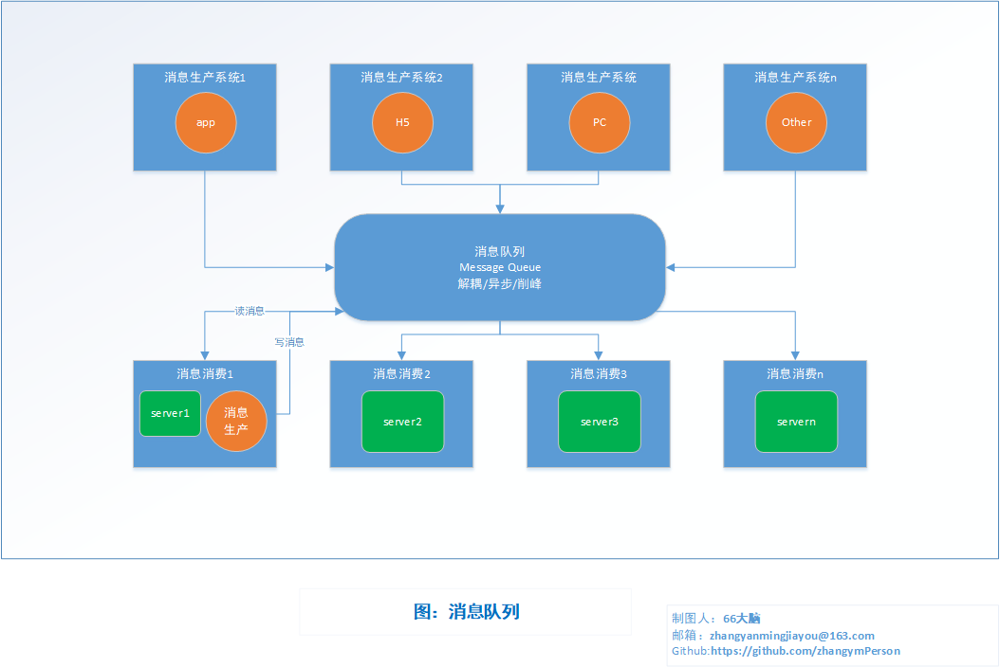

# MQ 的介绍和对比

## 目录

- [返回](../README.md)

## 其他

## MQ 的概念

- 概念

  消息队列（MQ）是一种应用程序对应用程序的通信方法。

  应用程序通过写和检索出入列队的针对应用程序的数据（消息）来通信，而无需专用连接来链接它们。

  消息传递指的是程序之间通过在消息中发送数据进行通信，而不是通过直接调用彼此来通信，直接调用通常是用于诸如远程过程调用的技术。

  排队指的是应用程序通过队列来通信。队列的使用除去了接收和发送应用程序同时执行的要求。

  [MQ-百度百科](https://baike.baidu.com/item/MQ/9062942)

  消息本质上是一种数据结构;

  它包含消费者与服务双方都能识别的数据，这些数据需要在不同的进程（机器）之间进行传递，并可能会被多个完全不同的客户端消费。

  在众多分布式技术中，消息传递相较文件传递与远程过程调用（RPC）而言，似乎更胜一筹，因为它具有更好的平台无关性，并能够很好地支持并发与异步调用。对于 Web Service 与 RESTful 而言，则可以看做是消息传递技术的一种衍生或封装。

- 重要作用

  - 解耦

    **消息通道作为在客户端（消费者，Consumer）与服务（生产者，Producer）之间引入的间接层，可以有效地解除二者之间的耦合。**

  - 异步

    客户端响应通过订阅服务端服务，实现异步，降低客户等待时间

  - 削峰

    并发量大的时候，所有的请求直接怼到数据库，造成数据库连接异常

    消息队列中间件接收前台消息，先放到队列里，把峰值移动到队列中，然后慢慢的按照数据库能处理的并发量，从消息队列中慢慢拉取消息。在生产中，这个短暂的高峰期积压是允许的。

- 为什么要使用 Message Queue

  解耦

  在项目启动之初来预测将来项目会碰到什么需求，是极其困难的。消息队列在处理过程中间插入了一个隐含的、基于数据的接口层，两边的处理过程都要实现这一接口。这允许你独立的扩展或修改两边的处理过程，只要确保它们遵守同样的接口约束

  冗余

  有时在处理数据的时候处理过程会失败。除非数据被持久化，否则将永远丢失。消息队列把数据进行持久化直到它们已经被完全处理，通过这一方式规避了数据丢失 风险。**在被许多消息队列所采用的”插入-获取-删除”范式中**，在把一个消息从队列中删除之前，需要你的处理过程明确的指出该消息已经被处理完毕，确保你的 数据被安全的保存直到你使用完毕。

  扩展性

  因为消息队列解耦了你的处理过程，所以增大消息入队和处理的频率是很容易的；只要另外增加处理过程即可。不需要改变代码、不需要调节参数。扩展就像调大电力按钮一样简单。

  灵活性 & 峰值处理能力

  在访问量剧增的情况下，应用仍然需要继续发挥作用，但是这样的突发流量并不常见；如果为以能处理这类峰值访问为标准来投入资源随时待命无疑是巨大的浪费。使用消息队列能够使关键组件顶住增长的访问压力，而不是因为超出负荷的请求而完全崩溃。

  可恢复性

  当体系的一部分组件失效，不会影响到整个系统。消息队列降低了进程间的耦合度，所以即使一个处理消息的进程挂掉，加入队列中的消息仍然可以在系统恢复后被处理。而这种允许重试或者延后处理请求的能力通常是造就一个略感不便的用户和一个沮丧透顶的用户之间的区别。

  送达保证

  消息队列提供的冗余机制保证了消息能被实际的处理，只要一个进程读取了该队列即可。在此基础上，IronMQ 提供了一个”只送达一次”保证。无论有多少进 程在从队列中领取数据，每一个消息只能被处理一次。这之所以成为可能，是因为获取一个消息只是”预定”了这个消息，暂时把它移出了队列。除非客户端明确的 表示已经处理完了这个消息，否则这个消息会被放回队列中去，在一段可配置的时间之后可再次被处理。

  顺序保证

  在许多情况下，数据处理的顺序都很重要。消息队列本来就是排序的，并且能保证数据会按照特定的顺序来处理。IronMO 保证消息浆糊通过 FIFO（先进先出）的顺序来处理，因此消息在队列中的位置就是从队列中检索他们的位置。

  缓冲

  在任何重要的系统中，都会有需要不同的处理时间的元素。例如,加载一张图片比应用过滤器花费更少的时间。消息队列通过一个缓冲层来帮助任务最高效率的执行—写入队列的处理会尽可能的快速，而不受从队列读的预备处理的约束。该缓冲有助于控制和优化数据流经过系统的速度。

  理解数据流

  在一个分布式系统里，要得到一个关于用户操作会用多长时间及其原因的总体印象，是个巨大的挑战。消息系列通过消息被处理的频率，来方便的辅助确定那些表现不佳的处理过程或领域，这些地方的数据流都不够优化。

  异步通信

  很多时候，你不想也不需要立即处理消息。消息队列提供了异步处理机制，允许你把一个消息放入队列，但并不立即处理它。你想向队列中放入多少消息就放多少，然后在你乐意的时候再去处理它们。

- 缺点

  - 系统可用性

    系统之间增加了一层中间件，对中间件了解不足，使用不到位，会影响使用，增加系统的风险

  - 系统复杂性

    系统和系统虽然有效解耦，但是复杂性变大。会有各种 bug 和其他问题需要处理;
