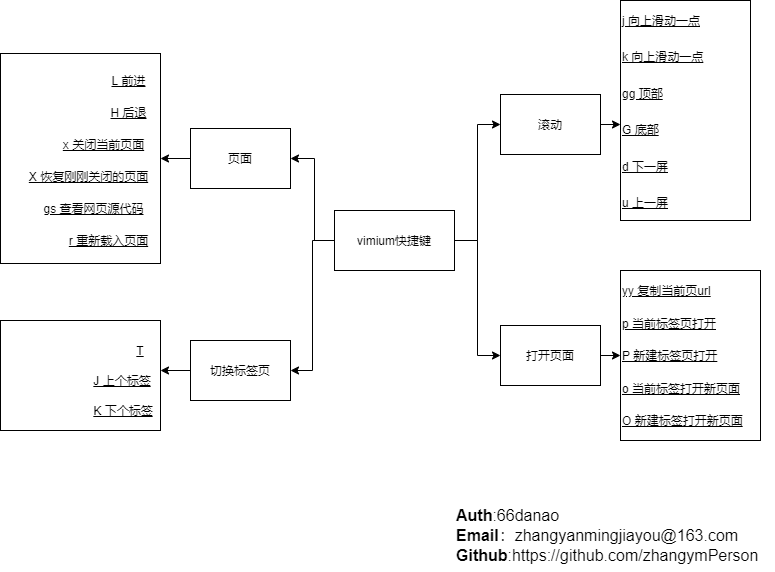

# 各种 工具

## 目录

## 其他

- [返回总目录](../README.md#项目目录)

- GitHub 查看插件

  [octotree](https://github.com/ovity/octotree)

- 开源中国插件

  [开源中国插件-oscnews](https://github.com/jaywcjlove/oscnews/releases)

- 浏览器时间桌面插件

  [时间桌面插件-momentum](https://momentumdash.com/)

- 浏览器 vim 插件(Vimium)

  谷歌浏览器 vim 插件

  浏览器的快捷键查看方式 `shift + /`

  快捷键使用方式
  

- 浏览器插件使用方法

  [谷歌优秀浏览器插件-github 地址](https://github.com/zhaoolee/ChromeAppHeroes

  下载 浏览器插件文件 .crx 文

  修改文件后缀为 zip,新建同名文件夹,将该 zip 文件放到文件夹下并解

  在谷歌浏览器中输入 chrome://extensions/ 打开开发者模

  加载已解压的扩展程序 选择 zip 文件所在的文件夹即可安装成

  重启浏览器

## 优秀开发工具

- 文本编辑器

  [notepad ++ ](https://notepad-plus-plus.org/)

* markdown 的优秀开发工具

  [vscode](https://code.visualstudio.com/) 微软出品的免费开源

  [typora](https://typora.io/) 免费 markdown 并且支持实时预览

* Java 开发工具

  [eclipse](https://www.eclipse.org/)

  [idea](http://www.jetbrains.com/idea/)

* 项目构建工具

  [maven](http://maven.apache.org/)

  [gradle](https://gradle.org)

* 请求模拟

  [mockito](https://github.com/mockito/mockito)

* 微软浏览器

  [微软浏览器新内核版本](https://www.microsoftedgeinsider.com/zh-cn/)
