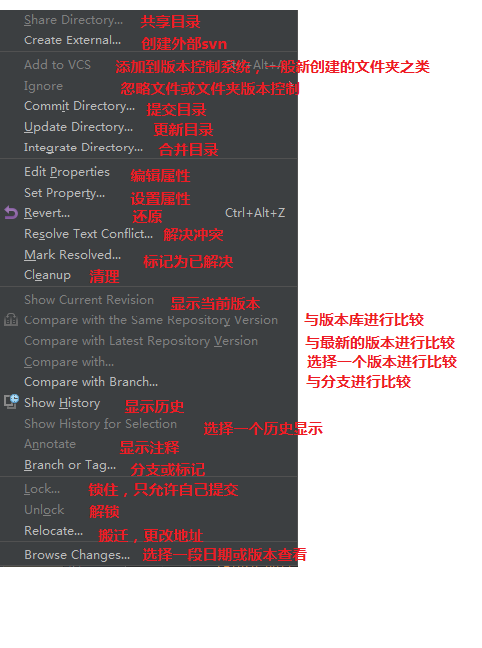

# idea-整合svn

- svn参数说明

- 代码提交

    Auto-update after commit :自动升级后提交

    keep files locked :把文件锁上，我想这应该就只能你修改其他开发人不能修改不了的功能

    在你提交之前：before commit

    Reformat code:重新格式化代码

    Rearrange code:重新整理代码

    Optimize imports：优化导入

    Perform code analysis：执行代码分析[ 默认选择]

    Check TODO(show all)：检测需要修改的代码[显示所有默认选择]

    clean up: 清除所有

    Update copyright:更新版权