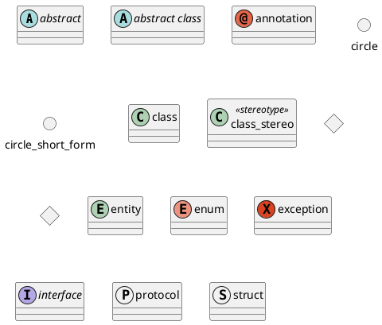
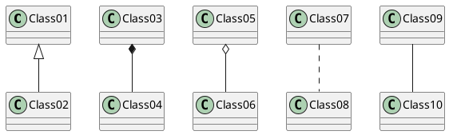

# uml 各种图

## 画图平台

- vscode + plantuml 插件

- uml


```plantuml
@startuml
abstract        abstract
abstract class  "abstract class"
annotation      annotation
circle          circle
()              circle_short_form
class           class
class           class_stereo  <<stereotype>>
diamond         diamond
<>              diamond_short_form
entity          entity
enum            enum
exception       exception
interface       interface
protocol        protocol
struct          struct

@enduml
```

- 插件暂不支持

```
metaclass       metaclass
stereotype      stereotype
```

- 类关系


```plantuml
@startuml
Class01 <|-- Class02
Class03 *-- Class04
Class05 o-- Class06
Class07 .. Class08
Class09 -- Class10
@enduml
```
