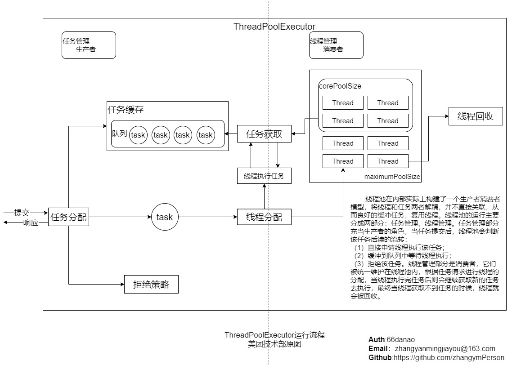

# 线程

- 线程，有时被称为轻量进程

  线程是程序中一个单一的顺序控制流程。进程内有一个相对独立的、可调度的执行单元，是系统独立调度和分派 CPU 的基本单位指令运行时的程序的调度单位。在单个程序中同时运行多个线程完成不同的工作，称为多线程。

  线程是进程中的实体，一个进程可以拥有多个线程，一个线程必须有一个父进程。线程不拥有系统资源，只有运行必须的一些数据结构；它与父进程的其它线程共享该进程所拥有的全部资源。线程可以创建和撤消线程，从而实现程序的并发执行。一般，线程具有就绪、阻塞和运行三种基本状态。

  线程在程序中是独立的、并发的执行路径，每个线程有它自己的堆栈、自己的程序计数器和自己的局部变量。但是，与分隔的进程相比，进程中的线程之间的隔离程度要小。它们共享内存、文件句柄和其它每个进程应有的状态。

## 线程的状态

## Java 中线程的相关方法

## java 中的线程的 wait 和 notify / notifyAll

- wait/notify 机制

  一个线程调用 Object 的 wait() 方法，使其线程被阻塞；另一线程调用 Object 的 notify()/notifyAll() 方法，wait() 阻塞的线程继续执行。

- wai/notify 方法说明
  | 方法 | 说明 |
  | --------------- | ------------------------------------------------------------------------------------------- |
  | wait() | 当前线程被阻塞，线程进入 WAITING 状态 |
  | wait(long) | 设置线程阻塞时长，线程会进入 TIMED_WAITING 状态。如果设置时间内（毫秒）没有通知，则超时返回 |
  | wait(long, int) | 纳秒级别的线程阻塞时长设置 |
  | notify() | 通知同一个对象上已执行 wait() 方法且获得对象锁的等待线程 |
  | notifyAll() | 通知同一对象上所有等待的线程 |

- 实现 wait/notify 机制的条件：

  - 调用 wait 线程和 notify 线程必须拥有相同对象锁。 wait 方法必须使用 `try{}catch{}`

  - wait() 方法和 notify()/notifyAll() 方法必须在 Synchronized 方法或代码块中。

  - 由于 wait/notify 方法是定义在 java.lang.Object 中，所以在任何 Java 对象上都可以使用。

## 线程的 `sleep` 和 `wait` 的区别

- **`sleep` 是 `Thread` 类的方法，`wait` 是 `Object` 类的方法**

- `Thread.sleep` 不会导致锁行为的改变，如果当前线程是拥有锁的，那么 `Thread.sleep` 不会让线程释放锁。

- `Thread.sleep` 和 `Object.wait` 都会暂停当前的线程，对于 CPU 资源来说，不管是哪种方式暂停的线程，都表示它暂时不再需要 CPU 的执行时间。OS 会将执行时间分配给其它线程。区别是，调用 `wait` 后，需要别的线程执行 `notify/notifyAll` 才能够重新获得 CPU 执行时间。

### 继承 Thread 类

- 简单代码

  ```java
  class MyThread extends Thread{
      private static int num = 0;

      public MyThread(){
          num++;
      }

      @Override
      public void run() {
          System.out.println("主动创建的第"+num+"个线程");
      }
  }
  ```

  ```java
  Thread.currentThread().getId() //获取线程id
  ```

- 注意:

  **线程启动需要使用调用 start() 方法,如果使用 run()方法则线程使用的是主线程,并没有新启动线程**

### 实现 Runable 接口

- 简单代码

  ```java

  class MyRunnable implements Runnable{

      public MyRunnable() {

      }

      @Override
      public void run() {
          System.out.println("子线程ID："+Thread.currentThread().getId());
      }
  }

  public class Test {
      public static void main(String[] args)  {
          System.out.println("主线程ID："+Thread.currentThread().getId());
          MyRunnable runnable = new MyRunnable();
          Thread thread = new Thread(runnable);
          thread.start();
      }
  }

  ```

## 线程池概念

- 线程池（英语：thread pool）

  一种线程使用模式。线程过多会带来调度开销，进而影响缓存局部性和整体性能。而线程池维护着多个线程，等待着监督管理者分配可并发执行的任务。这避免了在处理短时间任务时创建与销毁线程的代价。线程池不仅能够保证内核的充分利用，还能防止过分调度。可用线程数量应该取决于可用的并发处理器、处理器内核、内存、网络 sockets 等的数量。 例如，线程数一般取 cpu 数量+2 比较合适，线程数过多会导致额外的线程切换开销。

- 重要的几个概念

  1.线程池状态

  2.任务的执行

  3.线程池中的线程初始化

  4.任务缓存队列及排队策略

  5.任务拒绝策略

  6.线程池的关闭

  7.线程池容量的动态调整

- Java 的线程池

  核心实现类是**`ThreadPoolExecutor`**

- 原理图

  

* 相关阅读

  [Java 线程池实现原理及其在美团业务中的实践](https://tech.meituan.com/2020/04/02/java-pooling-pratice-in-meituan.html)
