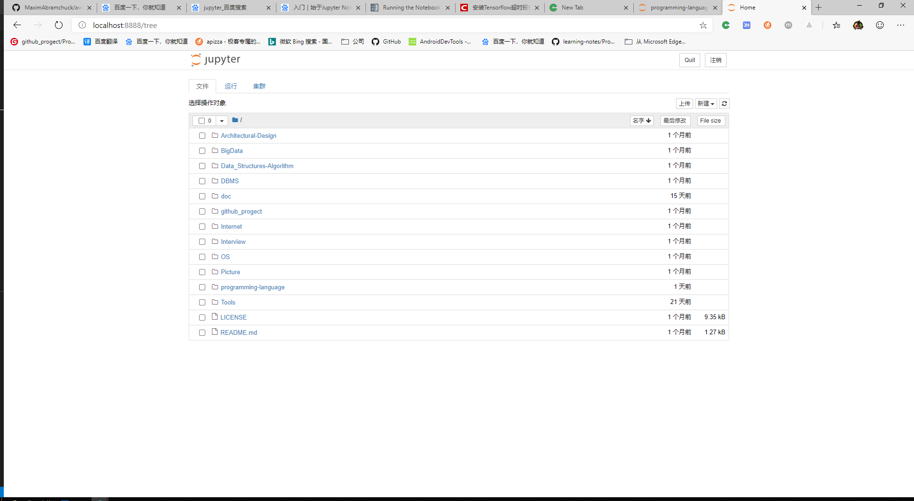

# 标题

- 图片测试



- 代码

  ```java
  public class Application {

      public static void main(String[] args) {
          System.out.println("hello word!");
      }
  }

  ```

  ```python
  print("hello word")

  ```
