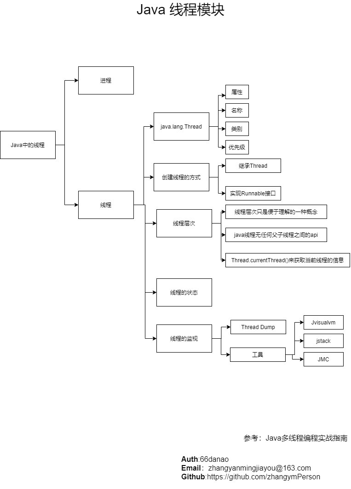

# Java 中多线程编程

- [返回](./README.md)
- [函数式编程](https://baike.baidu.com/item/函数式编程/4035031)

  以函数为基本抽象对象的编程方式

  函数式编程是种编程方式，它将电脑运算视为函数的计算。函数编程语言最重要的基础是 λ 演算（lambda calculus），而且 λ 演算的函数可以接受函数当作输入（参数）和输出（返回值）

- 对象编程

  以 Class 为基本抽象对象的编程方式

- 多线程编程

  以线程为一个基本抽象单位的编程方式

- 线程图解

  
