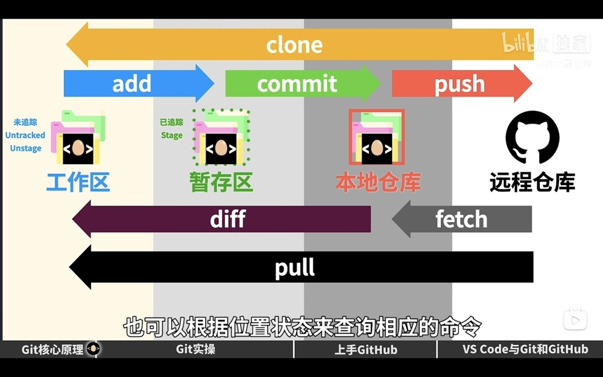
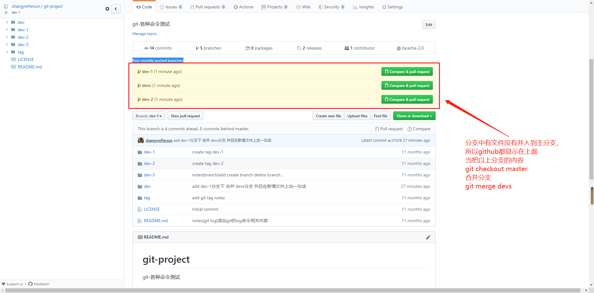

# git 命令

## 配置相关内容

- 配置 git 的邮箱

  **git config --global user.email "you@example.com"**

- 配置 git 的用户名

  **git config --global user.name "Your Name"**

- 配置单个项目的提交用户名和邮箱

  `$ git config user.name "username"`

  `$ git config user.email "username@xx.com"`

  `$ git config --list`

- 查看当前项目的提交用户名和邮箱

  `git config --list`

  查看当前配置, 在当前项目下面查看的配置是全局配置+当前仓库的配置, 使用的时候会**优先使用当前仓库的配置**

- 如果使用 ssh 连接 还需配置 ssh 密钥

- 任何操作都需要以 git 命令为开头

## 本地操作

- 下图为常用的开发命令

  

- git 常用命令

  **git init 初始化一个本地仓库 新建为 master 主分支**

  **git status 查看当前分支状态**

  **git add <文件名> 将文件更改添加到分支状态中 相当于文件等待被提交**

  **git commit -m <"描述信息"> 提交并添加描述信息**

  git branch 查看分支 前面带\*号的为当前所在分支

  git branch <分支名称> 新建分支

  **git checkout <分支名> 切换分支**

  git checkout -b <分支名> 新建分支并切换到此分支

  **git merge <分支名> 将指定分支名合并到当前分支 一般为切换到主分支使用此命令**

  git merge --no-ff -m "提交描述" <分支名> 合并分支并提交

  git branch -d <分支名> 有新建分支，那肯定有删除分支，假如这个分支新建错了，或者 a 分支的代码已经顺利合并到 master 分支来了，那么 a 分支没用了，需要删除，这个时候执行 git branch -d a 就可以把 a 分支删除了

  git branch -D <分支名> 强制删除分支，不管分支是否有未提交合并的代码

  git tag 查看所有标签

  git tag <标签名> 在当前状态下新建一个标签，可用来当作版本号使用

  git tag -a <标签名称> -m <"标签描述"> <提交 id> 在指定的提交状态下新建一个标签

  git show <标签名称> 查看标签的详情

  git tag -d <标签名> 删除标签

  **git push origin <标签名> 推送标签到远程仓库**

  git push origin --tags 推送所有未推送的标签

  git push origin :refs/tags/<标签名> 删除远程标签，本地要先删除后才可以

  git checkout <标签名> 切换到标签名指定的状态

  git diff <文件名> 查看文件修改内容

  **git log 查看提交日志 --pretty=oneline 此参数减少输出信息 穿梭前，用 git log 可以查看提交历史，以便确定要回退到哪个版本。**

  git reflog 要重返未来，用 git reflog 查看命令历史，以便确定要回到未来的哪个版本。

  git log --graph --pretty=oneline --abbrev-commit 查看分支合并图

  git reset --hard <HEAD^||提交 ID> 穿梭到指定提交版本

  HEAD 指向的版本就是当前版本，因此，Git 允许我们在版本的历史之间穿梭，使用命令 git reset --hard commit_id。

  git checkout -- <文件名> 将指定的文件恢复到最近一次 commit 或 add 操作时候的状态

  git reset HEAD <文件名> 将指定的文件从暂存区的修改撤销掉（unstage），重新放回工作区

  **git rm <文件名> 删除指定的文件**

  git stash 把当前工作现场“储藏”起来，等以后恢复现场后继续工作

  git stash list 查看暂存状态

  git stash apply 恢复暂存状态

  git stash drop 删除暂存状态

  git stash pop 恢复并删除暂存状态

  git stash apply <stash@{0}> 恢复指定的暂存状态

## 远征仓库操作

- 常用命令

  **git clone <远程地址> 从远征仓库拷贝过来代码，相当于建立本地分支**

  **git pull 将最新的提交从远程仓库抓取下来**

  **git push 将本地修改后的代码提交到远程仓库**

  git push <远程仓库名，默认 origin> <本地分支名> 将指定的分支推送到远程分支上

  **git push --mirror 推送所有分支到远程仓库**

  **git push --all origin 推送所有分支到远程仓**

  git remote -v 查看远程仓库 -v 为详细信息

  git checkout -b <本地支分支名> <远程仓库名，默认 origin>/<远程支分支名> 拉取远程主分支下的支分支。。。

  git branch --set-upstream <本地支分支名> <远程仓库名，默认 origin>/<远程支分支名> 将本地分支与远程指定的分支关联起来

  //以下为先有本地库，再建立远程库操作所用的命令
  git remote add origin `<URL 地址>` 本地库与远征库关联

  git push -u origin master 关联后，使用命令第一次推送 master 分支的所有内容， -u 参数为推送当前分支所有内容

  - 多个远程仓库强制拉去合并 gitee 为远程仓库别名 master 为指定分支 允许强制拉去不相干的仓库到本地仓库

    git pull gitee master --allow-unrelated-histories

## 注意

- 所有分支要并入 master 上

  github 上如果提交的分支中有内容没有在 master 分支下，则会在主页显示没有合并到 master 的分支，并推荐你合并到主分支下

  
