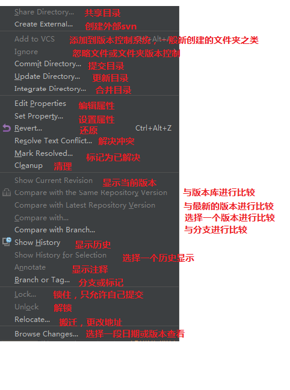

# idea-整合 svn

## 目录

- [返回](./README.md)

- svn 参数说明 

- 代码提交

  Auto-update after commit :自动升级后提交

  keep files locked :把文件锁上，我想这应该就只能你修改其他开发人不能修改不了的功能

  在你提交之前：before commit

  Reformat code:重新格式化代码

  Rearrange code:重新整理代码

  Optimize imports：优化导入

  Perform code analysis：执行代码分析[ 默认选择]

  Check TODO(show all)：检测需要修改的代码[显示所有默认选择]

  clean up: 清除所有

  Update copyright:更新版权

- idea 菜单栏中没有 svn 按钮的解决办法 上传下载的按钮找不到的解决办法

  - 打开菜单栏顶部的 VSC(version control system)按钮 版本控制系统

  - 点击 Enable Version Control Integration

  - 选择版本控制工具 选择 Subversion/git ...

- idea 底部的 svn 查看条的查看设置

  解决方案

  - 网上很多介绍 说使用 快捷键 alt+9 可以调试出来，尝试无反应 (先执行)

  - views-->tool window ----> 会发现 version controller 显示为灰色，点击无反应
